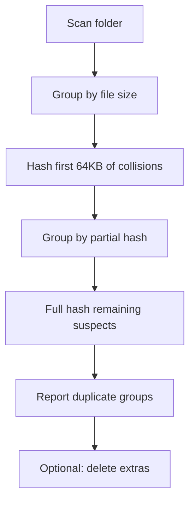

<div align="center">


     

</div>

## Overview

dupefinder scans a folder for duplicate files using a three-stage strategy: group by size, hash the first 64KB, then fully hash only remaining suspects. This keeps it fast on large directories while reporting how much space you could reclaim.

## Features

| | Feature | What it does |
|---|---|---|
| ⚡ | **Size grouping first** | Files with unique sizes are skipped instantly since they can't have duplicates. |
| 🔍 | **Partial hashing** | Only the first 64KB is hashed before doing a full comparison, saving time on big files. |
| 🧵 | **Threaded hashing** | Uses a ThreadPoolExecutor to hash files concurrently. |
| 🗑️ | **Optional deletion** | Pass --delete to remove extra copies (keeping the first) after confirmation. |
| 📏 | **Minimum size filter** | Use --min-size to ignore small files below a byte threshold. |
| 📊 | **Space report** | Prints how much space each duplicate group wastes and the total reclaimable space. |
| 🛡️ | **Safe scanning** | Skips symlinks and gracefully handles unreadable files via a decorator. |

## How it works



<details open>
<summary><b>Getting started</b></summary>

```bash
git clone <repo-url>
cd dupefinder
```

</details>

<details>
<summary><b>Usage example</b></summary>

```bash
python dupefinder.py ~/Downloads
python dupefinder.py ~/Downloads --delete --min-size 1048576
```

</details>

<details>
<summary><b>Project structure</b></summary>

```
.
└── dupefinder.py
```

</details>

<details>
<summary><b>How does it stay fast on large folders?</b></summary>

It avoids fully hashing every file by first filtering on size, then on a partial 64KB hash, only fully hashing real suspects.

</details>

<details>
<summary><b>Will it delete files automatically?</b></summary>

No, --delete only deletes after you confirm a prompt, and it always keeps the first copy of each group.

</details>

<details>
<summary><b>Does it follow symlinks?</b></summary>

No, symlinks are skipped during scanning.

</details>

## License

MIT
